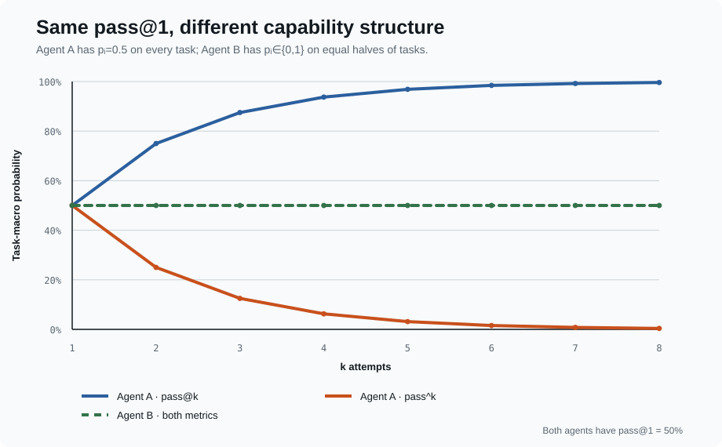
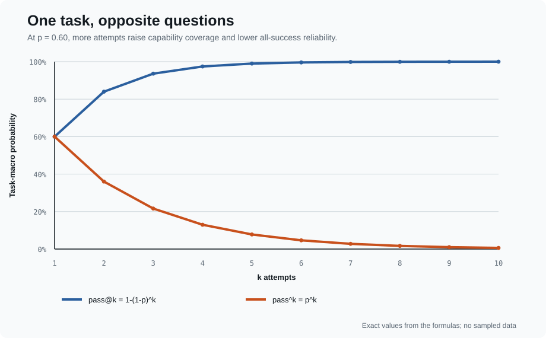

# 第 2 课:Repeated Trials——Capability 与 Reliability

## 同一个 Agent「有时能做到」和「每次都能做到」是两件事

**Week 3 Day 2** · 统计推断课 · 建议 70 分钟 + lab

> ### 本课唯一命题
> # `pass@k` 和 `pass^k` 不是同一个指标的两种写法。
> # 前者问 k 次里能否至少成功一次;后者问 k 次是否全部成功。选哪一个由产品使用方式决定。

> 📄 HumanEval/Codex §2.1、Appendix A · `pass@k` finite-sample estimator
> 📄 τ-bench §3 · `pass^k` reliability metric
> 📄 *On Randomness in Agentic Evals* §2.3–3
> 💻 输入:Lesson 1 的 canonical `TrialResult` table

```diag
compare | 相同的 repeated trials,两个相反的问题
Capability coverage · pass@k | Reliability · pass^k
k 次中至少一次成功 | k 次必须全部成功
retry / search / candidate generation | repeated customer-facing execution
随 k 单调上升 | 随 k 单调下降
需要能识别或选出成功结果 | 不允许一次坏结果混过去
```

---

## 零、先看两个 `pass@1=50%` 的 Agent

100 个 task,两种完全不同的 task-level success probability 分布:

```diag
compare | 平均分相同,行为结构不同
Agent A · uniform stochastic | Agent B · polarized specialist
每个 task 都有 pᵢ=0.5 | 50 个 task pᵢ=1,另 50 个 pᵢ=0
每道题都可能成也可能败 | 会的题永远会,不会的题永远不会
pass@1 = 50% | pass@1 = 50%
```

但 $k=5$ 时:

| Agent | `pass@1` | `pass@5` | `pass^5` |
|---|---:|---:|---:|
| A:每题 $p_i=0.5$ | 50.0% | 96.875% | 3.125% |
| B:一半 $p_i=1$,一半 $p_i=0$ | 50.0% | 50.0% | 50.0% |



Agent A 的能力**覆盖面**很大:多试几次几乎每题都可能撞对;但一致性差。Agent B 的能力边界很硬:重试没有帮助,但它会做的题非常稳定。

> **`pass@1` 只告诉你 $\mathbb E[p_i]$,没有告诉你 $p_i$ 在 tasks 之间怎样分布。**

---

## 一、先定义产品事件,再写公式

沿用 Lesson 1:

$$
p_i=P(Y_{ij}=1\mid T_i,A,C)
$$

假设同一 task 的 $k$ 次 attempts 在条件 $A,C$ 下 i.i.d.。对 task $i$:

$$
\operatorname{pass@k}_i
=P(\text{k 次中至少一次成功}\mid T_i)
=1-(1-p_i)^k
$$

$$
\operatorname{pass^k}_i
=P(\text{k 次全部成功}\mid T_i)
=p_i^k
$$

再对目标 task distribution 做 task-macro average:

$$
\operatorname{pass@k}=\mathbb E_T[1-(1-p_T)^k]
$$

$$
\operatorname{pass^k}=\mathbb E_T[p_T^k]
$$

两条曲线在 $k=1$ 相交:

$$
\operatorname{pass@1}=\operatorname{pass^1}=\mathbb E_T[p_T]
$$



### 1.1 `pass@k` 的「成功选择器」藏在哪里?

HumanEval 的定义是:为一道题生成 $k$ 个 samples,只要**任意一个**通过 unit tests 就算 solved。这里实际上有一个 oracle-quality selector——测试知道哪个 sample 是对的。

```diag
flow | pass@k 什么时候是可部署指标
生成 k 个独立 candidates
有 verifier / tests 能识别成功
允许选择成功 candidate
部署成本包含 k 次 inference + verification
```

若产品只能返回一个答案、也没有办法识别哪个 candidate 正确,`pass@k` 是 capability upper bound,不是用户实际拿到正确答案的概率。

### 1.2 `pass^k` 不是「单次 reliability 的替代名」

单次平均成功率仍是 `pass@1`。`pass^k` 问的是更严格的 batch event:随机挑 $k$ 次,零失败的概率。

一个每次成功率 95% 的稳定 task:

```text
pass^1  = 95.0%
pass^10 = 59.9%
pass^50 = 7.7%
```

低 `pass^50` 不等于单次成功率只有 7.7%;它表示连续 50 次全部无错是很高的门槛。报告时必须同时写 $k$。

---

## 二、为什么不能把 pooled success rate 代进公式

Lesson 1 规定先按 task 建模。本课现在看到原因:两个指标都是 $p_i$ 的**非线性函数**。

错误算法:

```text
先把所有 task × attempt pooled 成 p̄
再算 1-(1-p̄)^k 或 p̄^k
```

正确目标:

```text
每个 task 先算 1-(1-pᵢ)^k 或 pᵢ^k
再跨 tasks 等权平均
```

一般来说:

$$
\mathbb E[1-(1-p_T)^k]\ne 1-(1-\mathbb E[p_T])^k
$$

$$
\mathbb E[p_T^k]\ne (\mathbb E[p_T])^k
$$

这正是开场两个 Agent 的差别。Jensen inequality 还能给出方向($k\ge2$):

```diag
compare | 先 pooled 再变换会向哪边错
pass@k · concave transform | pass^k · convex transform
1-(1-E[p])^k 偏高 | E[p]^k 偏低
把 capability coverage 说得太乐观 | 把 deterministic specialists 说得太不可靠
```

注意:这是**跨 task aggregation error**。下一节还有另一种不同的错误:每个 task 只观察有限 attempts 时的 plug-in bias。

---

## 三、总体定义不是有限样本 estimator

真实实验不知道 $p_i$。对 task $i$,我们只运行 $n$ 次,其中 $c$ 次成功。

```diag
compare | n 和 k 不准混
n · observed attempts | k · metric / deployment budget
为了估计而实际收集多少次 | 问随机取多少次时的产品事件
必须 n ≥ k | 可以画 1…n 的曲线
例:n=10 | 例:报告 pass@5 / pass^5
```

HumanEval/Codex 给出的 per-task unbiased estimator 是:

$$
\widehat{\operatorname{pass@k}}_i
=1-\frac{\binom{n-c}{k}}{\binom nk}
$$

τ-bench 对称地给出:

$$
\widehat{\operatorname{pass^k}}_i
=\frac{\binom c k}{\binom nk}
$$

直觉不是「估一个 $p$ 再做幂」,而是:

> 从已经观察到的 $n$ 次 attempts 中,不放回地随机选 $k$ 次;有多少个组合满足至少一次成功 / 全部成功?

然后 task-macro average:

$$
\widehat{\operatorname{pass@k}}
=\frac1N\sum_i\left(1-\frac{\binom{n_i-c_i}{k}}{\binom{n_i}{k}}\right)
$$

$$
\widehat{\operatorname{pass^k}}
=\frac1N\sum_i\frac{\binom{c_i}{k}}{\binom{n_i}{k}}
$$

### 3.1 为什么直接代入 $\hat p_i=c_i/n_i$ 会偏

常见 shortcut:

$$
1-(1-c/n)^k,\qquad(c/n)^k
$$

因为非线性,有限样本中它们不是上面目标的 unbiased estimator。对 $k\ge2$:

- plug-in `pass@k` 通常向下偏;
- plug-in `pass^k` 通常向上偏。

```diag
grid | 两种错误必须分别抓
跨 tasks 先 pooled | aggregation / Jensen error
task 内先用 c/n 做幂 | finite-sample plug-in bias
修复:每 task 变换再平均 | 修复:组合数 estimator
```

### 3.2 边界检查比背公式更重要

对任意 task、$1\le k\le n$:

```text
k=1:  pass@1_hat = pass^1_hat = c/n
c=0:  两条曲线都为 0
c=n:  两条曲线都为 1
pass^k_hat ≤ pass@1_hat ≤ pass@k_hat
pass@k 随 k 不下降;pass^k 随 k 不上升
n<k:  undefined,不能外推成一个数字
```

---

## 四、i.i.d. 不是一个无害的小字

公式把 attempts 看作在同一个 $(T_i,A,C)$ 下的独立同分布重复。

```diag
grid | 一次合法的 repeated-attempt protocol
same SUT | model · harness · prompt/tools/config 不变
same task semantics | instruction · initial state · verifier 不变
fresh environment | 不继承文件、数据库、git history、cache 答案
independent randomness | 不复用上一次 trajectory 或 feedback
recorded conditions | temperature · provider · budget · infra version 可审计
```

### 4.1 有 feedback 的 retry 不是这里的 `pass@k`

```diag
compare | 两种「再试一次」
i.i.d. fresh attempts | Adaptive retry policy
每次从同一初态独立开始 | 看见前一次失败再改策略
pass@k / pass^k 的对象 | 整个 retry controller 是新的 SUT
```

若 Agent 读取上一次错误、总结失败原因再修补,第二次成功概率已经条件于第一次轨迹。正确做法是把「最多重试 k 次的 controller」整体当成一个 Agent system,一次完整 controller execution 算一条 TrialResult。

### 4.2 共享故障会制造相关性

Anthropic 的实践说明:残留文件、共享 cache、资源耗尽会让 trials 不独立。同一个 provider incident 也可能让一整列 attempts 同时失败。

这不会靠组合数公式自动消失。canonical table 应保留 run/batch/infra identity,Lesson 3 再决定 cluster-aware uncertainty;Week 6 决定 infra failure 的分母语义。

---

## 五、Reliability gap 有用,但不是无条件的「随机性分数」

定义同一个 $k$ 下的展示量:

$$
G_k=\operatorname{pass@k}-\operatorname{pass^k}
$$

```diag
compare | gap 何时宽,何时窄
pᵢ 接近 0 或 1 | pᵢ 在中间
重试很少改变 task outcome | favorable / unfavorable path 都常见
pass curves 靠近 | pass curves 分开
```

$G_k$ 的正确读法:

- 同一个 Agent、同一个 task distribution、同一个 $k$ 下,展示 success 对随机 path 的依赖程度;
- $G_1=0$ 是定义决定的,不是 Agent 完美稳定;
- $k$ 增大时 gap 会机械变化,不能拿 $G_2$ 与 $G_{10}$ 直接比较;
- 换一套更难或更异质的 tasks,gap 也会变,所以它不是脱离 benchmark 的 Agent 常数。

对于 deterministic task probabilities($p_i\in\{0,1\}$),三条曲线完全重合。开场的 Agent B 就是这个极端。

---

## 六、真实数据:随机性不是 temperature 开关

*On Randomness in Agentic Evals* 对 SWE-bench Verified 收集 60,000 条 trajectories。DeepSWE-preview + R2E-Gym 的例子:

```text
pass@1 = 34.4%
pass@5 = 52.9%   · optimistic coverage
pass^5 = 15.5%   · all-five reliability
```

同一个 Agent 的「至少一次能解」与「连续五次都能解」相差 37.4 pp。论文还观察到 temperature 0 下明显的 run-to-run variance,说明 deterministic decoding 参数不等于 deterministic agent system。

```diag
flow | 长轨迹怎样把微小差异变成 outcome 差异
早期 token / tool call 分叉
不同 environment response
后续 context 改变
策略路径继续分离
最终一条 PASS · 一条 FAIL
```

这些数字是该论文六种 model–scaffold configurations 上的实证结果,不是所有 agent benchmark 的固定规律。课程引用它是为了证明 repeated trials 有现实必要,不是把 coding-agent 方差外推到所有领域。

---

## 七、`Don't Pass@k` 到底反对什么?

ICLR 2026 的 *Don't Pass@k* 关注的是:当 task 数和 trials 都少、$k$ 接近已收集的 $n$ 时,用 `pass@k` 给模型做 leaderboard ranking 可能不稳定,又缺少显式 uncertainty。论文提出 Bayesian posterior mean + credible interval 作为替代排名协议。

```diag
compare | 不要把争论压成「pass@k 好 / 坏」
作为产品 estimand | 作为默认 leaderboard estimator
有 k 次预算且能选出成功结果时有意义 | 小 n、无 interval 时可能排名不稳
回答 capability coverage | 不自动回答 A 是否显著优于 B
保留,并报告 cost / k / protocol | 配合 Lesson 3–4 的 uncertainty 与 comparison
```

所以本课不把论文读成「删除 `pass@k`」。讨论题是:

> `pass@k` 在这份报告里究竟是部署事件、capability envelope,还是拿来强行排出一个赢家的 leaderboard statistic?

三者需要的证据不同。

---

## 八、Lab:从 canonical rows 生成四张图

### 8.1 参考实现

```python
from math import comb

def pass_at_k(n: int, c: int, k: int) -> float:
    if not 1 <= k <= n:
        raise ValueError("require 1 <= k <= n")
    return 1.0 - comb(n - c, k) / comb(n, k)

def pass_hat_k(n: int, c: int, k: int) -> float:
    if not 1 <= k <= n:
        raise ValueError("require 1 <= k <= n")
    return comb(c, k) / comb(n, k)
```

`math.comb(a,k)` 在 $a<k$ 时返回 0,正好覆盖「成功数不足 k」或「失败数不足 k」的边界。大 $n$ 时可改用 HumanEval 的 product-form 实现避免巨大组合数在其他语言中溢出。

### 8.2 四张图,每张只回答一个问题

```diag
grid | Lesson 2 plots
1 · task-attempt heatmap | 哪些 task 稳定成功 / 失败 / 红绿相间?
2 · pass curves | pass@k 上升、pass^k 下降得多快?
3 · ordered task rates | cᵢ/nᵢ 是 polarized 还是集中在中间?
4 · reliability gap | 同一 k 下两条曲线相距多少?
```

Plot 2 必须同时显示:

```text
x = k
y = benchmark task-macro estimate
lines = pass@k, pass^k
reference = pass@1
caption = N tasks, n attempts/task, eligible tasks at each k
```

若各 task 的 $n_i$ 不同,不能让 $k$ 增大时悄悄换掉 task set。优先预先规划相同 $n$;否则固定 common eligible set,并显式报告每个 $k$ 的 support。missingness 的处理留给 Week 6,但不能隐藏。

### 8.3 Tests

```text
[ ] k=1 时两种 estimator 都等于 task-macro c/n
[ ] pass@k 单调不降,pass^k 单调不升
[ ] 每个点都在 [0,1]
[ ] n<k 明确报错,不 extrapolate
[ ] macro 是 per-task estimator 的平均,不是 pooled c / pooled n
[ ] Agent A/B toy example 复现开场表格
[ ] null / infra rows 未被静默当作 failure 或删除
```

---

## 九、读材料时只回答这些问题

### HumanEval/Codex

- $n$ 与 $k$ 各是什么?为什么论文实际生成 $n=200$ 才报告 $k\le100$?
- 为什么 `1-(1-c/n)^k` 有 bias?
- pass@k 里的 oracle selection 在 HumanEval 由什么实现?
- 论文为什么为不同 $k$ 选择不同 temperature?这是否改变了 SUT/condition?

### τ-bench

- 为什么 customer-service agent 更需要 `pass^k`?
- 用户模拟器的随机措辞是否仍保持相同 task semantics?
- `pass^1=pass@1=E[c/n]` 为什么成立?
- `pass^8<25%` 是单次成功率,还是八次全过的概率?

### 2026 两篇讨论材料

- *On Randomness* 的 60,000 trajectories 证明了什么,没有证明什么?
- *Don't Pass@k* 反对的是产品 estimand,还是用小样本 point estimate 排行?
- 如果报告 credible interval,是否就解决了 task validity 和 verifier validity?为什么没有?

来源:

- [Evaluating Large Language Models Trained on Code](https://arxiv.org/abs/2107.03374)
- [τ-bench](https://arxiv.org/abs/2406.12045)
- [On Randomness in Agentic Evals](https://arxiv.org/abs/2602.07150)
- [Don't Pass@k](https://arxiv.org/abs/2510.04265)
- [Anthropic: Demystifying evals for AI agents](https://www.anthropic.com/engineering/demystifying-evals-for-ai-agents)

---

## 本课自检

```text
[ ] 能用产品语言区分 pass@k 与 pass^k
[ ] 能从 pᵢ 推导 1-(1-pᵢ)^k 与 pᵢ^k
[ ] 能解释为什么 E[f(pᵢ)] 不等于 f(E[pᵢ])
[ ] 能区分 aggregation error 与 finite-sample plug-in bias
[ ] 能写出两个组合数 estimator,并解释 n 与 k
[ ] 能说明 pass@k 的 verifier / oracle-selection 假设
[ ] 能识别 adaptive retry 已经改变了 SUT
[ ] 能说出 reliability gap 的三个比较限制
[ ] 能解释 Don't Pass@k 为什么不是简单地宣布 pass@k 无效
[ ] 能从 canonical rows 生成四张图并通过 monotonicity tests
```

---

## 本课一句话

> **`pass@k` 衡量「给足 k 次机会能不能找到成功路径」;`pass^k` 衡量「随机取 k 次能不能零失败」。**
> **先按 task 用有限样本 estimator,再跨 task 平均;指标回答哪个产品事件,必须和 $k$、选择器、成本与 independence protocol 一起报告。**

下一课:两条曲线都是 point estimates。40 tasks × 10 attempts 为什么仍不是 400 个独立 observations,95% error bar 应怎样匹配 task 层级?
